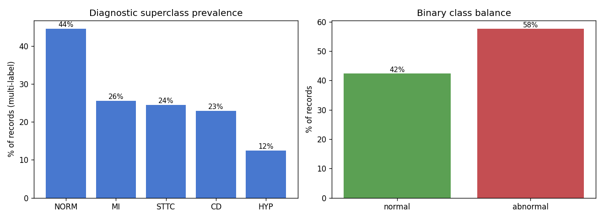
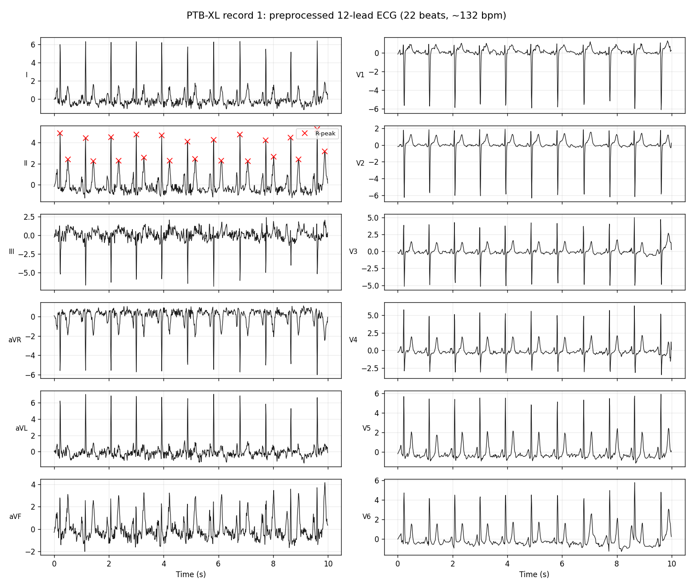
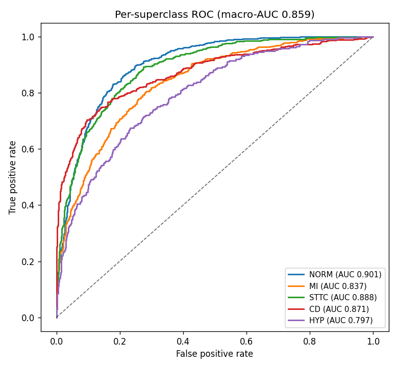
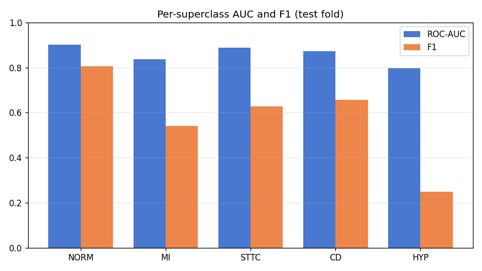
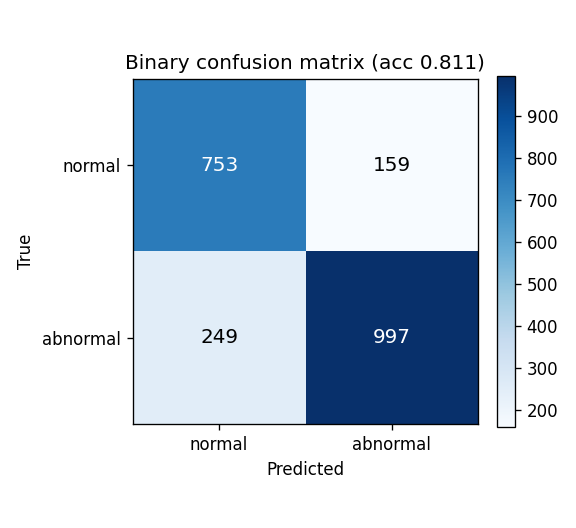
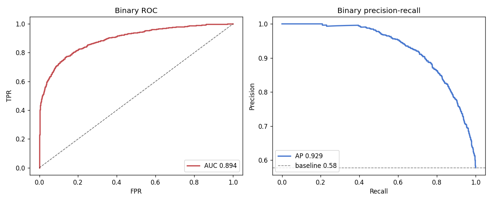
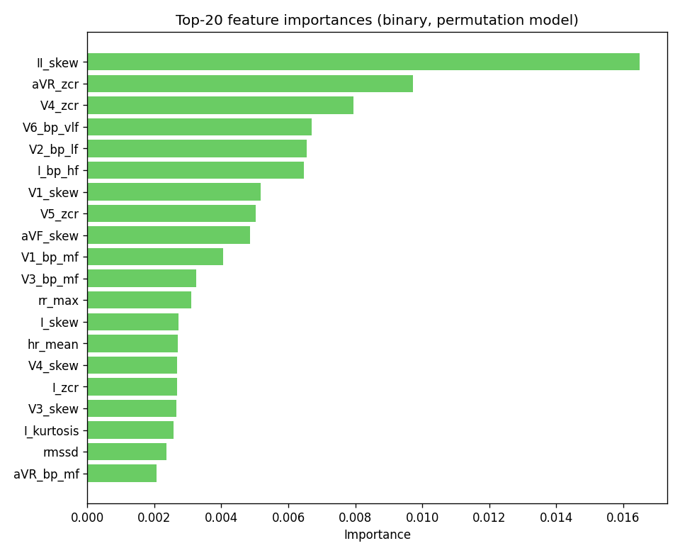

# การคัดกรองภาวะหัวใจเต้นผิดจังหวะอัตโนมัติจาก ECG 12 ลีด ด้วยชุดข้อมูล PTB-XL

**รายงานโปรเจกต์** · *ภาษา: [English](REPORT.md) · ไทย · [Tiếng Việt](report_vn.md)*
**ชุดข้อมูล:** PTB-XL (ECG ทางคลินิกแบบ 12 ลีด)
**ประเภทการวิเคราะห์:** การประมวลผลสัญญาณชีวการแพทย์ร่วมกับการจำแนกด้วยการเรียนรู้
ของเครื่องแบบดั้งเดิม (จำแนกกลุ่มวินิจฉัยแบบหลายป้าย และจำแนกแบบสองกลุ่ม ปกติ/ผิดปกติ)

> **ข้อจำกัดความรับผิดชอบเชิงวิชาการ:** โปรเจกต์นี้จัดทำเพื่อการศึกษาเท่านั้น ผลลัพธ์
> ทั้งหมดอ้างอิงจากชุดข้อมูลวิจัยสาธารณะ และต้องไม่นำไปใช้ในบริบททางคลินิกหรือการวินิจฉัยใด ๆ

---

## 1. บทนำ

โรคหัวใจและหลอดเลือดเป็นสาเหตุการเสียชีวิตอันดับหนึ่งของโลก และคลื่นไฟฟ้าหัวใจ (ECG)
คือเครื่องมือที่ใช้กันแพร่หลายที่สุด มีต้นทุนต่ำ และไม่รุกล้ำร่างกาย สำหรับประเมินกิจกรรม
ทางไฟฟ้าของหัวใจ ECG มาตรฐานแบบ 12 ลีดมองหัวใจจากหลายมุม ทำให้แพทย์ตรวจพบความผิดปกติ
ของจังหวะ การนำไฟฟ้า ภาวะขาดเลือด และการเปลี่ยนแปลงเชิงโครงสร้าง เช่น ภาวะหัวใจโต ได้

การอ่านด้วยมือใช้เวลานานและต้องอาศัยความเชี่ยวชาญที่ไม่ได้มีอยู่เสมอ ณ จุดดูแลผู้ป่วย
การวิเคราะห์อัตโนมัติช่วยคัดกรองเบื้องต้นได้อย่างรวดเร็ว ทำเครื่องหมายสัญญาณที่ผิดปกติ
เพื่อให้ตรวจทานก่อน และสนับสนุนการคัดแยกผู้ป่วย คุณค่าทางคลินิกของระบบเช่นนี้ขึ้นกับ
**ความไว (sensitivity)** มากกว่าความแม่นยำดิบ เพราะการพลาด ECG ที่ผิดปกติจริงมีต้นทุน
สูงกว่าการแจ้งเตือนผิดพลาดมาก

โปรเจกต์นี้สร้างไปป์ไลน์แบบครบวงจรที่จำแนก ECG 12 ลีด โดยใช้**การประมวลผลสัญญาณชีว
การแพทย์แบบดั้งเดิม** (การกรองสัญญาณ การตรวจจับจุดยอด R และการวิเคราะห์เชิงสเปกตรัม)
ร่วมกับโมเดลการเรียนรู้ของเครื่องทั่วไป โดยไม่ใช้การเรียนรู้เชิงลึก เป้าหมายคือวัดว่า
ฟีเจอร์ที่ออกแบบด้วยมือและตีความได้ สามารถดึงสัญญาณวินิจฉัยออกมาได้มากเพียงใด

---

## 2. รายละเอียดชุดข้อมูล

### 2.1 ภาพรวม

**PTB-XL** (Wagner และคณะ, 2020) เป็นหนึ่งในชุดข้อมูล ECG ทางคลินิกสาธารณะที่ใหญ่ที่สุด
ประกอบด้วยการบันทึก 12 ลีด ความยาว 10 วินาที จำนวน **21,799 รายการ** จากผู้ป่วย
**18,869 คน** แต่ละรายการมีการกำกับโดยแพทย์โรคหัวใจด้วยรหัส SCP-ECG โปรเจกต์นี้ใช้
ข้อมูลที่ **100 Hz** ซึ่งเป็นมาตรฐานสำหรับงานการเรียนรู้ของเครื่องบน PTB-XL

### 2.2 รูปแบบสัญญาณ

| คุณสมบัติ | ค่า |
|----------|-----|
| ลีด | 12 (I, II, III, aVR, aVL, aVF, V1-V6) |
| ความยาว | 10 วินาที |
| อัตราการสุ่ม | 100 Hz (1,000 จุดต่อลีด) |
| การจัดเก็บ | รูปแบบ WFDB (สัญญาณ `.dat` + ส่วนหัว `.hea`) |

### 2.3 กลุ่มวินิจฉัยหลัก (Superclass)

รหัส SCP ของแต่ละรายการจับคู่กับกลุ่มวินิจฉัยหลักหนึ่งกลุ่มหรือมากกว่า จากทั้งหมดห้ากลุ่ม
งานหลักจึงเป็นการจำแนก **แบบหลายป้าย (multi-label)**

| รหัส | ความหมาย |
|------|----------|
| NORM | ECG ปกติ |
| MI | กล้ามเนื้อหัวใจตาย |
| STTC | การเปลี่ยนแปลงคลื่น ST/T |
| CD | ความผิดปกติของการนำไฟฟ้า |
| HYP | ภาวะหัวใจโต |

### 2.4 การกระจายของกลุ่ม

หลังจากตัดรายการที่ไม่มีกลุ่มวินิจฉัยออก เหลือ **21,388** รายการ ข้อมูลมีความ
ไม่สมดุล ผลรวมของจำนวนเกินจำนวนรายการทั้งหมดเพราะเป็นป้ายแบบหลายป้าย

| กลุ่มวินิจฉัย | จำนวน | สัดส่วน |
|-------------|-------|---------|
| NORM (ECG ปกติ) | 9,514 | 44.5% |
| MI (กล้ามเนื้อหัวใจตาย) | 5,469 | 25.6% |
| STTC (การเปลี่ยนแปลง ST/T) | 5,235 | 24.5% |
| CD (ความผิดปกติของการนำไฟฟ้า) | 4,898 | 22.9% |
| HYP (ภาวะหัวใจโต) | 2,649 | 12.4% |

รายการจะเป็น **ปกติ** ก็ต่อเมื่อมีกลุ่มวินิจฉัยเดียวคือ NORM เท่านั้น ทำให้มีรายการปกติ
9,069 รายการ และผิดปกติ 12,319 รายการ
(ผิดปกติ 57.6%)

*ภาพที่ 1: สัดส่วนกลุ่มวินิจฉัยหลัก (ซ้าย) และสมดุลของสองกลุ่ม (ขวา)*

ความไม่สมดุลนี้เป็นปัจจัยสำคัญที่สุดในการสร้างโมเดล โดยกำหนดทั้งการถ่วงน้ำหนักกลุ่ม
ตัวชี้วัด และช่องว่างของประสิทธิภาพรายกลุ่มด้านล่าง

---

## 3. คำถามวิจัย

**คำถามหลัก** ฟีเจอร์การประมวลผลสัญญาณแบบดั้งเดิมที่ตีความได้ สามารถดึงข้อมูลวินิจฉัย
จาก ECG 12 ลีดออกมาได้มากเพียงใด

**คำถามย่อย**
1. ฟีเจอร์ที่ออกแบบด้วยมือแยกกลุ่มวินิจฉัยทั้งห้าได้หรือไม่ และกลุ่มใดง่ายหรือยากที่สุด
2. โมเดลที่ไม่ใช้ข้อมูลอภิพันธุ์ คัดกรองปกติ/ผิดปกติได้ดีเพียงใด
3. การแลกเปลี่ยนระหว่างความไวและความจำเพาะสำหรับการคัดกรองเป็นอย่างไร
4. ฟีเจอร์สัญญาณใดมีน้ำหนักวินิจฉัยมากที่สุด และสอดคล้องกับสรีรวิทยาหัวใจหรือไม่

---

## 4. ระเบียบวิธี

### 4.1 การประมวลผลเบื้องต้น
แต่ละรายการถูกกรองด้วย **ตัวกรองแบนด์พาส Butterworth อันดับ 4 (0.5-40 Hz แบบเฟสศูนย์
`filtfilt`)** เพื่อกำจัดการเลื่อนของเส้นฐานและสัญญาณรบกวนความถี่สูง จากนั้น **ปรับมาตรฐาน
แบบ z-score รายลีด**

*ภาพที่ 2: รายการเดียวหลังประมวลผล ครบทั้ง 12 ลีด พร้อมจุดยอด R ที่ตรวจพบ
(เครื่องหมาย x สีแดง) บนลีด II*

### 4.2 การสกัดฟีเจอร์
เวกเตอร์ฟีเจอร์ความยาวคงที่ **128 ฟีเจอร์** ต่อรายการ ได้แก่ **จังหวะ/HRV** จากจุดยอด R
บนลีด II; **สถิติเชิงเวลารายลีด** (ส่วนเบี่ยงเบนมาตรฐาน, RMS, พิสัย, ความเบ้, ความโด่ง,
อัตราการตัดศูนย์); และ **กำลังแถบความถี่รายลีด** (วิธี Welch ในสี่แถบ)

### 4.3 การแบ่งข้อมูล
การแบ่ง `strat_fold` อย่างเป็นทางการของ PTB-XL ป้องกันการรั่วของข้อมูลผู้ป่วย:
**โฟลด์ 1-8 ฝึก (17,084)**, **โฟลด์ 9 ตรวจสอบ (2,146)**,
**โฟลด์ 10 ทดสอบ (2,158)** ผลทั้งหมดด้านล่างมาจากโฟลด์ 10

### 4.4 โมเดล
Logistic Regression, Random Forest (300 ต้น) และ Histogram Gradient Boosting
ในไปป์ไลน์ `StandardScaler` แต่ละตัวใช้ `class_weight="balanced"` และเลือกโมเดลที่ดีที่สุด
บนชุดตรวจสอบ

### 4.5 ตัวชี้วัด
**ROC-AUC** (การจัดอันดับที่ไม่ขึ้นกับค่าขีดแบ่ง) เป็นตัวชี้วัดหลัก เสริมด้วย F1, ความแม่นยำ,
average precision, ความไว และความจำเพาะ

---

## 5. ผลลัพธ์

โมเดลที่ดีที่สุดของทั้งสองงานคือ **hist_gbdt**

| งาน | ตัวชี้วัดหลัก |
|-----|-------------|
| 5 กลุ่ม (หลายป้าย) | macro-AUC **0.859**, micro-AUC 0.884 |
| สองกลุ่ม (ปกติ/ผิดปกติ) | ROC-AUC **0.894**, ความแม่นยำ 0.811, F1 0.830 |

### 5.1 การแยกแยะแบบหลายป้าย

*ภาพที่ 3: เส้น ROC รายกลุ่มวินิจฉัย (macro-AUC 0.859)*

เส้น ROC ทั้งห้าอยู่เหนือเส้นสุ่มอย่างชัดเจน ยืนยันว่าฟีเจอร์ที่ออกแบบด้วยมือมีสัญญาณ
วินิจฉัยจริง กลุ่ม **NORM** ง่ายที่สุด (AUC 0.901)
และ **HYP** ยากที่สุด (AUC 0.797)

| กลุ่มวินิจฉัย | ROC-AUC | F1 | ความแม่นยำ |
|-------------|---------|----|-----------|
| NORM | 0.901 | 0.805 | 0.819 |
| STTC | 0.888 | 0.627 | 0.842 |
| CD | 0.871 | 0.657 | 0.866 |
| MI | 0.837 | 0.540 | 0.804 |
| HYP | 0.797 | 0.248 | 0.885 |

*ภาพที่ 4: ROC-AUC รายกลุ่ม เทียบกับ F1 ที่ค่าขีดแบ่ง 0.5*

AUC ยังคงสูงในขณะที่ **F1 ลดลงสำหรับกลุ่มที่พบน้อย** อันเป็นช่องว่างจากความไม่สมดุล
ความแม่นยำรายป้าย (Hamming) เฉลี่ย 84.3% แต่การทายถูกครบทั้งห้าป้าย
เกิดขึ้นเพียง 50.4% ของเวลา จึงใช้ AUC ไม่ใช่ความแม่นยำ เป็นตัวชี้วัดหลัก

### 5.2 การคัดกรองแบบสองกลุ่ม

*ภาพที่ 5: เมทริกซ์ความสับสนปกติ/ผิดปกติ ที่ค่าขีดแบ่ง 0.5
(ความไว 80.0%, ความจำเพาะ 82.6%)*

ข้อผิดพลาดที่มีต้นทุนสูงคือช่องล่างซ้าย: **ผลลบลวง 249 ราย** คือ ECG ที่ผิดปกติแต่
ถูกทายว่าปกติ จุดทำงานปัจจุบันให้ความไว 80.0% เทียบกับความจำเพาะ 82.6%

*ภาพที่ 6: ROC (AUC 0.894) และ precision-recall
(average precision 0.929)*

เส้น precision-recall เป็นมุมมองที่ตรงไปตรงมากว่าภายใต้ความไม่สมดุล และอยู่สูงกว่าเส้น
ฐานบวกที่ 0.58 อย่างชัดเจน

### 5.3 ความสำคัญของฟีเจอร์

*ภาพที่ 7: ฟีเจอร์ 20 อันดับแรกตามความสำคัญ*

ฟีเจอร์ที่ให้ข้อมูลมากที่สุดมาจาก:

1. `II_skew`
2. `aVR_zcr`
3. `V4_zcr`
4. `V6_bp_vlf`
5. `V2_bp_lf`
6. `I_bp_hf`
7. `V1_skew`
8. `V5_zcr`
9. `aVF_skew`
10. `V1_bp_mf`

ฟีเจอร์เหล่านี้สอดคล้องกับสรีรวิทยาที่รู้จัก: สถิติรูปร่างรายลีด (ความเบ้ อัตราการตัดศูนย์)
สะท้อนสัณฐานของ QRS/T, กำลังแถบความถี่จับเนื้อหาเชิงความถี่ และพจน์ HRV จับจังหวะ

---

## 6. อภิปราย

- **สัญญาณวินิจฉัยมีจริงแต่ไม่สม่ำเสมอ** macro-AUC 0.859 จากฟีเจอร์เพียง
  อย่างเดียวเป็นเส้นฐานแบบดั้งเดิมที่แข็งแรง ประสิทธิภาพแปรตามว่ารูปแบบแต่ละกลุ่มเฉพาะที่
  มากเพียงใด (NORM ง่ายสุด, HYP ยากสุด)
- **ความไม่สมดุลกำหนดทุกอย่าง** NORM มีจำนวนมาก ความแม่นยำจึงทำให้เข้าใจผิด และกลุ่ม
  ที่พบน้อยมีช่องว่าง AUC กับ F1 จึงควรปรับค่าขีดแบ่งรายกลุ่ม
- **การคัดกรองโดยไม่ใช้ข้อมูลอภิพันธุ์ทำได้จริง** AUC สองกลุ่ม 0.894 พร้อม
  ความไว 80.0% เป็นสัญญาณคัดแยกที่ใช้ได้ ไม่ใช่การวินิจฉัย
- **ฟีเจอร์มีเหตุผลเชิงสรีรวิทยา** ทำให้โมเดลตรวจสอบย้อนได้

---

## 7. ข้อจำกัด

1. ฟีเจอร์แบบดั้งเดิมมีเพดานต่ำกว่าการเรียนรู้เชิงลึก (CNN ที่เผยแพร่ ~0.93 macro-AUC
   เทียบกับ 0.859 ที่นี่)
2. ตรวจจับจุดยอด R บนลีด II เท่านั้น
3. F1/ความแม่นยำที่รายงานใช้ค่าขีดแบ่งคงที่ 0.5
4. ใช้สัญญาณ 100 Hz เท่านั้น
5. ค่าความเป็นไปได้ของรหัส SCP ถูกยุบเป็นการมี/ไม่มีกลุ่มแบบสองค่า
6. ใช้เพื่อการศึกษาเท่านั้น ยังไม่ผ่านการตรวจสอบทางคลินิก

---

## 8. สรุป

การประมวลผลสัญญาณแบบดั้งเดิมดึงโครงสร้างที่มีความหมายจาก ECG 12 ลีดได้:
**macro-AUC 0.859** สำหรับห้ากลุ่มวินิจฉัย และ **ROC-AUC
0.894** สำหรับการคัดกรองสองกลุ่ม บนโฟลด์ทดสอบที่แยกผู้ป่วยกัน พร้อมฟีเจอร์ที่
ตีความเชิงสรีรวิทยาได้ แม้แทนที่การอ่านของผู้เชี่ยวชาญหรือโมเดลเชิงลึกไม่ได้ แต่เป็นเส้นฐาน
ที่โปร่งใสสำหรับเครื่องมือคัดแยก งานในอนาคต: การปรับค่าขีดแบ่งรายกลุ่ม ฟีเจอร์เวฟเล็ต/
แม่แบบการเต้น สัญญาณ 500 Hz และเส้นฐาน CNN แบบ 1 มิติ

---

## เอกสารอ้างอิง

Goldberger, A. L., et al. (2000). PhysioBank, PhysioToolkit, and PhysioNet.
*Circulation, 101*(23), e215-e220.

Pan, J., & Tompkins, W. J. (1985). A real-time QRS detection algorithm.
*IEEE Transactions on Biomedical Engineering, BME-32*(3), 230-236.

Strodthoff, N., Wagner, P., Schaeffter, T., & Samek, W. (2021). Deep learning
for ECG analysis: Benchmarks and insights from PTB-XL. *IEEE JBHI, 25*(5),
1519-1528.

Wagner, P., et al. (2020). PTB-XL, a large publicly available electrocardiography
dataset. *Scientific Data, 7*, 154.
